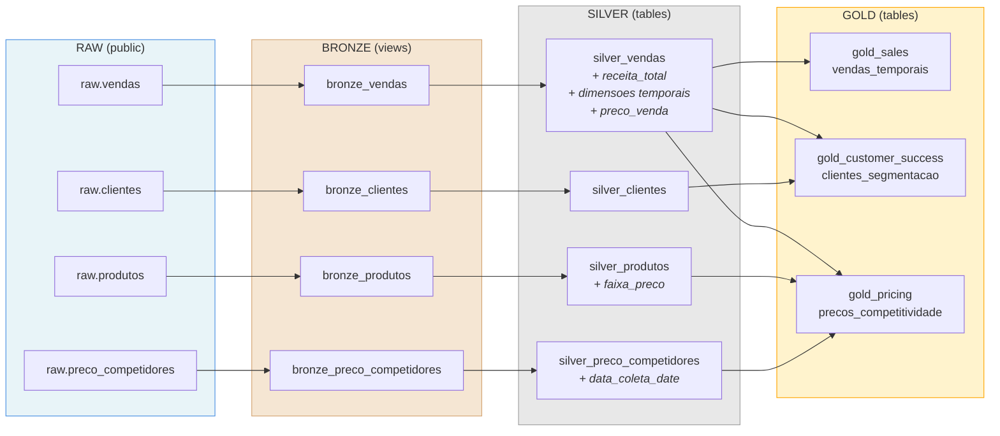

# Dia 3: dbt & Camada Analitica | Jornada de Dados

Projeto dbt com arquitetura Medalhao (Bronze -> Silver -> Gold) usando PostgreSQL.

**11 modelos** organizados em 3 camadas e 3 Data Marts.

---

## Estrutura do Projeto

```
aula-03-dbt/
├── dbt_project.yml              # Configuracoes centralizadas (materializacao, schemas, variaveis)
├── profiles.yml                 # Conexao com o banco PostgreSQL
├── models/
│   ├── _sources.yml             # Definicao das 4 tabelas raw
│   ├── bronze/                  # 4 views  - Dados brutos
│   │   ├── bronze_vendas.sql
│   │   ├── bronze_clientes.sql
│   │   ├── bronze_produtos.sql
│   │   └── bronze_preco_competidores.sql
│   ├── silver/                  # 4 tables - Colunas calculadas
│   │   ├── silver_vendas.sql
│   │   ├── silver_clientes.sql
│   │   ├── silver_produtos.sql
│   │   └── silver_preco_competidores.sql
│   └── gold/                    # 3 tables - 1 por Data Mart
│       ├── sales/
│       │   └── gold_sales_vendas_temporais.sql
│       ├── customer_success/
│       │   └── gold_customer_success_clientes_segmentacao.sql
│       └── pricing/
│           └── gold_pricing_precos_competitividade.sql
├── macros/
└── tests/
```

---

## Fluxo de Dados



---

## Passo a Passo

### 1. Instalar dependencias

```bash
pip install dbt-core dbt-postgres
```

### 2. Inicializar o perfil de conexao

```bash
dbt init
```

O dbt vai perguntar interativamente as credenciais do banco:

```text
Which database would you like to use?
[1] postgres

host: seu-host.supabase.com
port [5432]: 5432
user: seu-usuario
password: sua-senha
dbname [postgres]: postgres
schema [public]: public
threads [1]: 4
```

Isso cria o arquivo `~/.dbt/profiles.yml` e a pasta do projeto `ecommerce/`.

```bash
cd ecommerce
```

### 3. Conhecer as pastas do dbt

O `dbt init` cria a seguinte estrutura de pastas:

| Pasta | O que faz |
| ----- | --------- |
| `models/` | Onde ficam os arquivos SQL que viram tabelas/views no banco |
| `seeds/` | Arquivos CSV que o dbt carrega direto no banco |
| `macros/` | Funcoes reutilizaveis em Jinja (como funcoes em Python) |
| `tests/` | Testes customizados em SQL |
| `snapshots/` | Captura historico de mudancas (SCD Type 2) |
| `analyses/` | Queries SQL de analise que nao viram tabelas |

### 4. Limpar a estrutura padrao

Vamos remover as pastas que nao usaremos e o modelo de exemplo:

```bash
rm -rf analyses snapshots seeds macros tests
rm -rf models/example
```

### 5. Criar a arquitetura Medalhao

Vamos organizar os modelos em 3 camadas: Bronze -> Silver -> Gold.

```bash
mkdir -p models/bronze
mkdir -p models/silver
mkdir -p models/gold/sales
mkdir -p models/gold/customer_success
mkdir -p models/gold/pricing
```

Estrutura final:

```text
models/
├── _sources.yml             # Definicao das tabelas fonte (raw)
├── bronze/                  # 4 views  - Copia exata do raw
├── silver/                  # 4 tables - Colunas calculadas
└── gold/                    # 3 tables - 1 por Data Mart
    ├── sales/
    ├── customer_success/
    └── pricing/
```

### 6. Configurar o dbt_project.yml

Editar o `dbt_project.yml` para definir a materializacao e schema de cada camada. Esse arquivo e o coracao do projeto dbt — ele controla como cada modelo e materializado no banco.

```yaml
name: 'ecommerce'                    # Nome do projeto (mesmo do dbt init)
version: '1.0.0'
config-version: 2

profile: 'ecommerce'                 # Deve bater com o nome no profiles.yml

# Pastas do projeto
model-paths: ["models"]
analysis-paths: ["analyses"]
test-paths: ["tests"]
seed-paths: ["seeds"]
macro-paths: ["macros"]
snapshot-paths: ["snapshots"]

target-path: "target"
clean-targets:
  - "target"
  - "dbt_packages"

# Configuracoes de modelos por camada
models:
  ecommerce:                          # Deve bater com o name do projeto
    bronze:
      +materialized: view             # Views - sempre atualizadas, sem custo de storage
      +schema: bronze                 # Schema: public_bronze
      +tags: ["bronze", "raw"]
      +meta:
        modeling_layer: bronze

    silver:
      +materialized: table            # Tables - colunas calculadas persistidas
      +schema: silver                 # Schema: public_silver
      +tags: ["silver", "cleaned"]
      +meta:
        modeling_layer: silver

    gold:
      +materialized: table            # Tables - KPIs prontos para consumo
      +tags: ["gold", "kpi", "metrics"]
      +meta:
        modeling_layer: gold
      sales:
        +schema: gold_sales           # Schema: public_gold_sales
      customer_success:
        +schema: gold_customer_success # Schema: public_gold_customer_success
      pricing:
        +schema: gold_pricing         # Schema: public_gold_pricing

# Variaveis do projeto
vars:
  segmentacao_vip_threshold: 10000    # Receita minima para cliente VIP
  segmentacao_top_tier_threshold: 5000 # Receita minima para TOP_TIER
```

**Por que configurar aqui e nao dentro de cada `.sql`?** Centralizar no `dbt_project.yml` evita repetir `{{ config() }}` em cada modelo. Todos os modelos dentro da pasta `bronze/` herdam automaticamente `materialized: view` e `schema: bronze`.

### 7. Criar o _sources.yml

O `_sources.yml` diz ao dbt onde estao as tabelas originais no banco. Sem ele, o dbt nao sabe que as tabelas `vendas`, `clientes`, etc. existem.

Criar o arquivo `models/_sources.yml`:

```yaml
version: 2

sources:
  - name: raw                        # Nome logico (usado no {{ source() }})
    description: "Tabelas brutas do banco de dados (fonte original)"
    schema: public                    # Schema real onde as tabelas estao no PostgreSQL
    tables:
      - name: vendas
        description: "Tabela de vendas realizadas"
        columns:
          - name: id_venda
            description: "ID unico da venda"
          - name: data_venda
            description: "Data e hora da venda"
          - name: id_cliente
            description: "ID do cliente"
          - name: id_produto
            description: "ID do produto"
          - name: canal_venda
            description: "Canal de venda (ecommerce, loja_fisica)"
          - name: quantidade
            description: "Quantidade vendida"
          - name: preco_unitario
            description: "Preco unitario da venda"

      - name: clientes
        description: "Tabela de clientes cadastrados"
        columns:
          - name: id_cliente
            description: "ID unico do cliente"
          - name: nome_cliente
            description: "Nome do cliente"
          - name: estado
            description: "Estado do cliente"
          - name: pais
            description: "Pais do cliente"
          - name: data_cadastro
            description: "Data de cadastro do cliente"

      - name: produtos
        description: "Tabela de produtos cadastrados"
        columns:
          - name: id_produto
            description: "ID unico do produto"
          - name: nome_produto
            description: "Nome do produto"
          - name: categoria
            description: "Categoria do produto"
          - name: marca
            description: "Marca do produto"
          - name: preco_atual
            description: "Preco atual do produto"
          - name: data_criacao
            description: "Data de criacao do produto"

      - name: preco_competidores
        description: "Tabela de precos coletados de concorrentes"
        columns:
          - name: id_produto
            description: "ID do produto"
          - name: nome_concorrente
            description: "Nome do concorrente"
          - name: preco_concorrente
            description: "Preco do concorrente"
          - name: data_coleta
            description: "Data de coleta do preco"
```

**Por que usar sources?** Em vez de escrever `SELECT * FROM public.vendas` direto no SQL, usamos `{{ source('raw', 'vendas') }}`. Isso permite ao dbt rastrear a linhagem dos dados (lineage) e saber de onde cada modelo vem.

### 8. Testar a conexao

```bash
dbt debug
```

Valida se o dbt consegue se conectar ao banco. Voce deve ver `All checks passed!` no final.

### 9. Executar todos os modelos

```bash
dbt run
```

O dbt resolve as dependencias e executa na ordem correta: Bronze (4 views) -> Silver (4 tables) -> Gold (3 tables).

### 10. Executar por camada (opcional)

```bash
# Somente bronze (4 views)
dbt run --select tag:bronze

# Somente silver (4 tables)
dbt run --select tag:silver

# Somente gold (3 tables)
dbt run --select tag:gold
```

### 11. Executar modelo especifico com dependencias

```bash
# O + executa o modelo e todos os que ele depende
dbt run --select +gold_sales_vendas_temporais
dbt run --select +gold_customer_success_clientes_segmentacao
dbt run --select +gold_pricing_precos_competitividade
```

### 12. Verificar os dados no banco

Apos o `dbt run`, os schemas criados no PostgreSQL sao:

| Schema | Tabelas |
| ------ | ------- |
| `public_bronze` | bronze_vendas, bronze_clientes, bronze_produtos, bronze_preco_competidores |
| `public_silver` | silver_vendas, silver_clientes, silver_produtos, silver_preco_competidores |
| `public_gold_sales` | gold_sales_vendas_temporais |
| `public_gold_customer_success` | gold_customer_success_clientes_segmentacao |
| `public_gold_pricing` | gold_pricing_precos_competitividade |

### 13. Gerar documentacao

```bash
# Gerar catalogo de dados
dbt docs generate

# Abrir no navegador (localhost:8080)
dbt docs serve
```

A documentacao inclui o lineage graph (DAG) mostrando as dependencias entre os modelos.

---

## Configuracao (dbt_project.yml)

```yaml
models:
  ecommerce:
    bronze:
      +materialized: view
      +schema: bronze
    silver:
      +materialized: table
      +schema: silver
    gold:
      +materialized: table
      sales:
        +schema: gold_sales
      customer_success:
        +schema: gold_customer_success
      pricing:
        +schema: gold_pricing

vars:
  segmentacao_vip_threshold: 10000
  segmentacao_top_tier_threshold: 5000
```

---

## Resumo da Arquitetura

| Camada | Modelos | Materializacao | O que faz |
| ------ | ------- | -------------- | --------- |
| **Bronze** | 4 | view | Copia exata do raw (contrato do dado) |
| **Silver** | 4 | table | Colunas calculadas (receita_total, faixa_preco, dimensoes temporais) |
| **Gold** | 3 | table | JOINs + agregacoes (1 KPI por Data Mart) |

---

## Schemas por Camada

### BRONZE - Dados Brutos (4 views)

Copia exata das tabelas raw. Materializado como **view**. Contrato minimo do dado.

#### bronze_vendas

| Coluna | Origem |
| ------ | ------ |
| id_venda | raw.vendas |
| data_venda | raw.vendas |
| id_cliente | raw.vendas |
| id_produto | raw.vendas |
| canal_venda | raw.vendas |
| quantidade | raw.vendas |
| preco_unitario | raw.vendas |

#### bronze_clientes

| Coluna | Origem |
| ------ | ------ |
| id_cliente | raw.clientes |
| nome_cliente | raw.clientes |
| estado | raw.clientes |
| pais | raw.clientes |
| data_cadastro | raw.clientes |

#### bronze_produtos

| Coluna | Origem |
| ------ | ------ |
| id_produto | raw.produtos |
| nome_produto | raw.produtos |
| categoria | raw.produtos |
| marca | raw.produtos |
| preco_atual | raw.produtos |
| data_criacao | raw.produtos |

#### bronze_preco_competidores

| Coluna | Origem |
| ------ | ------ |
| id_produto | raw.preco_competidores |
| nome_concorrente | raw.preco_competidores |
| preco_concorrente | raw.preco_competidores |
| data_coleta | raw.preco_competidores |

---

### SILVER - Colunas Calculadas (4 tables)

Mesmas colunas do bronze + **novas colunas calculadas**. Materializado como **table**. Sem JOINs.

#### silver_vendas

| Coluna | Tipo | Descricao |
| ------ | ---- | --------- |
| id_venda | original | ID da venda |
| id_cliente | original | FK cliente |
| id_produto | original | FK produto |
| quantidade | original | Quantidade vendida |
| **preco_venda** | **renomeado** | preco_unitario renomeado |
| data_venda | original | Data/hora da venda |
| canal_venda | original | Canal de venda |
| **receita_total** | **calculado** | quantidade * preco_unitario |
| **data_venda_date** | **calculado** | DATE(data_venda) |
| **ano_venda** | **calculado** | EXTRACT(YEAR) |
| **mes_venda** | **calculado** | EXTRACT(MONTH) |
| **dia_venda** | **calculado** | EXTRACT(DAY) |
| **dia_semana** | **calculado** | EXTRACT(DOW) - 0=Domingo, 6=Sabado |
| **hora_venda** | **calculado** | EXTRACT(HOUR) |

#### silver_clientes

| Coluna | Tipo | Descricao |
| ------ | ---- | --------- |
| id_cliente | original | ID do cliente |
| nome_cliente | original | Nome do cliente |
| estado | original | Estado |
| pais | original | Pais |
| data_cadastro | original | Data de cadastro |

#### silver_produtos

| Coluna | Tipo | Descricao |
| ------ | ---- | --------- |
| id_produto | original | ID do produto |
| nome_produto | original | Nome do produto |
| categoria | original | Categoria |
| marca | original | Marca |
| preco_atual | original | Preco atual |
| data_criacao | original | Data de criacao |
| **faixa_preco** | **calculado** | PREMIUM (>1000), MEDIO (>500), BASICO |

#### silver_preco_competidores

| Coluna | Tipo | Descricao |
| ------ | ---- | --------- |
| id_produto | original | FK produto |
| nome_concorrente | original | Nome do concorrente |
| preco_concorrente | original | Preco do concorrente |
| data_coleta | original | Data/hora da coleta |
| **data_coleta_date** | **calculado** | DATE(data_coleta) |

---

### GOLD - KPIs (3 tables, 1 por Data Mart)

JOINs entre tabelas silver + agregacoes. Materializado como **table**. Dados prontos para dashboards.

#### gold_sales_vendas_temporais

**Pergunta:** Qual foi minha receita por data?

Metricas de venda agregadas por data/hora. Fonte: `silver_vendas`

| Coluna | Descricao |
| ------ | --------- |
| data_venda | Data da venda |
| ano_venda | Ano |
| mes_venda | Mes |
| dia_venda | Dia |
| dia_semana_nome | Domingo, Segunda, ..., Sabado |
| hora_venda | Hora |
| receita_total | SUM(receita_total) |
| quantidade_total | SUM(quantidade) |
| total_vendas | COUNT(DISTINCT id_venda) |
| total_clientes_unicos | COUNT(DISTINCT id_cliente) |
| ticket_medio | AVG(receita_total) |

---

#### gold_customer_success_clientes_segmentacao

**Pergunta:** Quais sao meus melhores clientes?

Segmentacao de clientes por receita. JOIN: `silver_vendas` + `silver_clientes`

| Coluna | Descricao |
| ------ | --------- |
| cliente_id | ID do cliente |
| nome_cliente | Nome |
| estado | Estado |
| receita_total | SUM(receita_total) |
| total_compras | COUNT(DISTINCT id_venda) |
| ticket_medio | AVG(receita_total) |
| primeira_compra | MIN(data_venda_date) |
| ultima_compra | MAX(data_venda_date) |
| segmento_cliente | VIP (>=R$10k), TOP_TIER (>=R$5k), REGULAR |
| ranking_receita | ROW_NUMBER por receita |

---

#### gold_pricing_precos_competitividade

**Pergunta:** Como estamos em relacao a concorrencia?

Analise de preco vs concorrentes. JOIN: `silver_produtos` + `silver_preco_competidores` + `silver_vendas`

| Coluna | Descricao |
| ------ | --------- |
| produto_id | ID do produto |
| nome_produto | Nome |
| categoria | Categoria |
| marca | Marca |
| nosso_preco | Nosso preco atual |
| preco_medio_concorrentes | AVG dos concorrentes |
| preco_minimo_concorrentes | MIN dos concorrentes |
| preco_maximo_concorrentes | MAX dos concorrentes |
| total_concorrentes | COUNT(DISTINCT concorrente) |
| diferenca_percentual_vs_media | % diferenca vs media |
| diferenca_percentual_vs_minimo | % diferenca vs minimo |
| classificacao_preco | MAIS_CARO_QUE_TODOS / MAIS_BARATO_QUE_TODOS / ACIMA_DA_MEDIA / ABAIXO_DA_MEDIA / NA_MEDIA |
| receita_total | Receita do produto |
| quantidade_total | Quantidade vendida |
